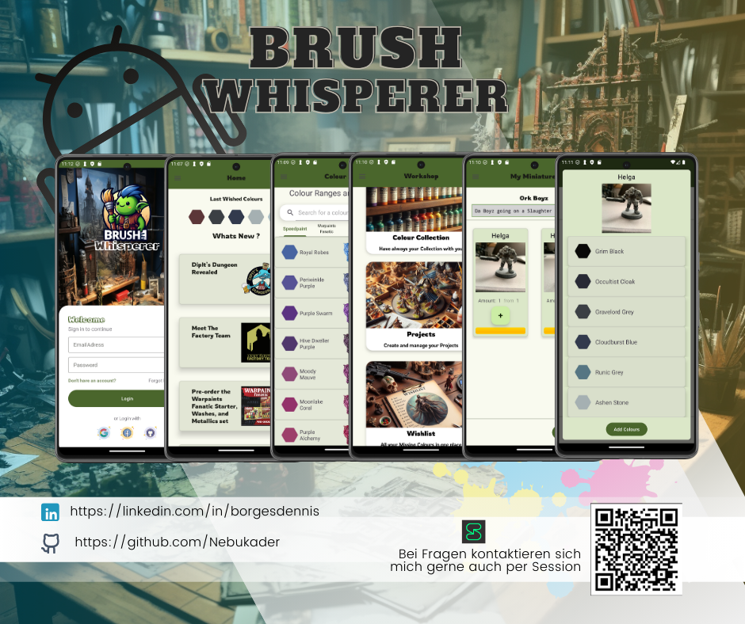

# Brush Whisperer 
Brush Whisperer ist eine Hobby App für Android geschrieben mit Kotlin

## Zweck der App
---
Die Idee für diese App entstand aus einem persönlichen Problem heraus. Ich bin neu im Hobby des Miniaturmalens eingestiegen (Tabletops wie Warhammer / Dungeon and Dragons, aber auch praktisch für 3D-Druck). Ich benötigte Farben und wusste ungefähr, was ich wollte, kaufte aber am Ende im Laden eine Farbe, die ich bereits besaß, und hatte sie somit doppelt. Daher dachte ich, es wäre praktisch, solche frustrierenden Momente zu vermeiden, wenn man seine Farbsammlung bzw. Wunschliste immer bei sich hat. So entwickelte sich die Idee für diese App.

### Funktionen der App
---
Hier ist ein Überblick über die Funktionen:

- Nachrichten aus dem Hobbybereich, z.B. zu neuen Farben.
- Die App bezieht aktuelle Nachrichten aus dem Hobbybereich durch Webscraping, so dass die Benutzer stets über Neuigkeiten informiert sind.
- Eine Hobby-Farbdatenbank, die derzeit etwa 500 Farben enthält und kontinuierlich erweitert wird.
- Die Möglichkeit, die eigene Farbsammlung in der App zu verwalten.
- Eine Wunschliste, damit du immer im Auge hast, welche besonderen Farben dir noch für dein Projekt oder deine Sammlung fehlen.
- Die Möglichkeit, eigene Projekte zu planen. Das bedeutet, dass man sich beispielsweise eine Box mit Miniaturen kauft oder druckt und dann Farben für die einzelnen Figuren planen kann, um den Überblick nicht zu verlieren.
- Tutorials für Anfänger und Fortgeschrittene zum Thema Miniature Painting von professionellen Künstlern (YouTube).
- Deine Farbsammlung und Projekte bleiben selbst bei einem Wechsel auf ein neues Smartphone erhalten, da alles sicher in Firebase gespeichert ist. ( Aktuell können Nutzer nicht selbst ihren Account Löschen )

### Genutzte Dependencies
---
- [Retrofit](https://github.com/square/retrofit): Wird verwendet, um HTTP-Anfragen an einen REST-Server zu senden und die Ergebnisse zu verarbeiten. _(Kommunikation mit einem RESTful API)_
- [Moshi](https://github.com/square/moshi.git): Wird verwendet, um JSON-Daten zu serialisieren und deserialisieren. _(Datenkonvertierung)_
- [Coil](https://github.com/coil-kt/coil.git): Wird verwendet, um Bilder aus dem Internet zu laden und in der App anzuzeigen. _(Bilderladen und -anzeige)_
- [Room und KSP](https://developer.android.com/training/data-storage/room): Wird verwendet, um eine SQLite-Datenbank in der Android-App zu verwalten und die Verarbeitung von SQL-Anfragen zu vereinfachen. _(Lokale Datenspeicherung)_
- [Jsoup](https://github.com/jhy/jsoup.git): Wird verwendet, um HTML-Dateien zu analysieren und zu verarbeiten, beispielsweise zum Webscraping von Webseiten. _(Webscraping für die Nachrichtenfunktion)_
- [Youtube Player](https://github.com/PierfrancescoSoffritti/android-youtube-player): Wird verwendet, um YouTube-Videos in der App anzuzeigen und abzuspielen. _(Integration von YouTube-Tutorials)_
- [Firebase](https://github.com/gitliveapp/firebase-kotlin-sdk): Wird verwendet, um eine sichere Backend-Infrastruktur bereitzustellen und Daten in der Cloud zu speichern. _(Cloud-Datenbank und Authentifizierung)_

## Technologie
---
Die App basiert auf einer eigenen Datenbank ( MariaDB ) und einem Fullstack-Webserver ( Apache2 ), der auf einem Raspberry Pi läuft. Dies ermöglicht eine effiziente Verwaltung der Farbsammlung und Projekte, während gleichzeitig die Daten sicher gespeichert werden. Der Einsatz eines Raspberry Pi bietet eine kostengünstige und zugleich zuverlässige Lösung für den Betrieb meiner App.

### Geplante Updates und Ausbau der App
---
Hier sind einige geplante Updates und Ideen für den Ausbau der App:

- Integration einer Community-Funktion, die es Benutzern ermöglicht, ihre Projekte zu teilen, Feedback zu erhalten und sich mit Gleichgesinnten auszutauschen.
- Die Erweiterung und Umstrukturierung der Farbdatenbank
- Verbesserung der Suchfunktion in der Hobby-Farbdatenbank, um Benutzern dabei zu helfen, Farben schneller zu finden und zu filtern.
- Implementierung eines Benachrichtigungssystems für wichtige Aktualisierungen oder Änderungen in der App.
- Erweiterung der Tutorials-Sektion mit neuen Videos und Artikeln zu fortgeschrittenen Maltechniken und -technologien.
- Einbindung einer Funktion zur automatischen Erkennung von Farben mittels Kamera auf Bildern oder per Barcode, um Benutzern dabei zu helfen, ihre Farben in der App schnell zu identifizieren und zu erfassen.
- Implementierung einer Exportfunktion für die Wunschliste, z.B. nach Amazon, für die leichtere Bestellung der Wunschliste.

---
"Dein Feedback ist Gold wert! Als alleiniger Entwickler dieser App schätze ich jede Rückmeldung von dir. Hast du Vorschläge, Ideen oder einfach nur ein paar nette Worte? Zöger nicht, mich zu kontaktieren! Ich bin hier, um zuzuhören und die App noch besser zu machen. Also, lass von dir hören und lass uns zusammen etwas Großartiges erschaffen!"
